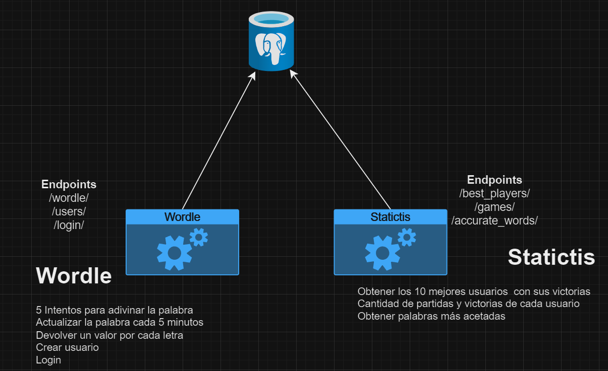

# Este proyecto es una prueba técnica para DD360

## Overview:
Creación de un API REST para jugar Wordle.
Se trata de que el sistema va a escoger una palabra de 5 letras con un tiempo de vida de 5 minutos.
El usuario podra intentar adivinar cual es la palbra con 5 intentos.

## Diagram

## Use cases to support:
- Login
- Registrar Usuario
- Wordle (Necesita autenticación y enviar el token en los headers)
- Cambiar la palabra cada 5 minutos

## Stack's technology

- Python
- FastAPI
- PostgreSQL
- Docker
- Docker Compose

## Instructions to install and run project

- docker compose build
- docker compose up

## Documentation
Para ver la documentación de las APIS click [aquí](https://github.com/roodrigoroot69/wordle/blob/main/docs/api_documentation.md).

Postman:
Download collection and import on your Postman
[Collection of Postman](https://drive.google.com/file/d/1Q4saIRLmZ2V8kc8JAurr8q3kE3siJ0SY/view?usp=sharing)
